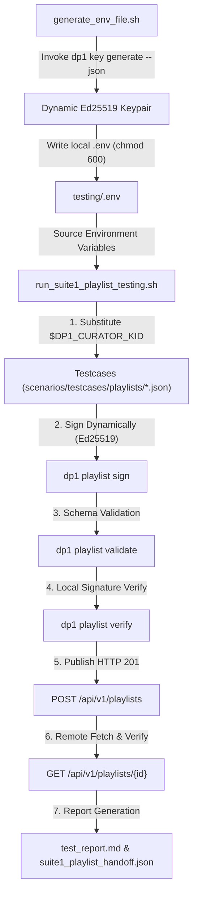

# 🧪 BM_Testing — Display Protocol (DP-1) Automated QA & Verification Suite

An independent, automated QA test suite for validating [Display Protocol v1 (DP-1)](https://github.com/display-protocol/dp1) implementations across CLI client binaries (`dp1-cli`), JSON schema specifications, Ed25519 cryptographic signature chains, and live Feed servers.

---

## 🎯 Objectives & Scope

The **BM_Testing** project provides end-to-end verification and regression testing for DP-1 document workflows. It validates:

- **JSON Schema Compliance**: Verifies that generated playlists adhere strictly to DP-1 v1.1.0 JSON schemas.
- **Cryptographic Signature Integrity**: Tests JCS canonicalization (RFC 8785), Ed25519 payload signing (`dp1 playlist sign`), and multi-signature verification (`dp1 playlist verify`).
- **Feed API Protocol Compatibility**: Tests live HTTP 201 publishing (`POST /api/v1/playlists`) to compatible Feed servers, HTTP 200 GET retrieval, and remote signature re-verification.
- **Negative & Boundary Validation**: Ensures that malformed schema attributes, tampered signatures, legacy single signatures, and invalid enum values are caught correctly.

---

## 🏗️ Architecture & Test Execution Sequence



---

## 💻 Environment & Setup Requirements

### Prerequisites

Ensure the following tools are installed on your environment:

- **Go**: Version `1.22+` (required to build `dp1-cli`).
- **Python**: Version `3.9+` (used for JSON handoff contract parsing and Markdown report generation).
- **Bash & cURL**: Standard POSIX shell and HTTP client.
- **Git**: Version Control System.

### Standalone Compatibility & CLI Binary Resolution

This repository (`BM_Testing`) is **100% standalone** and can be cloned and executed on any machine without hardcoded repository dependencies.

When executing `./run_suite1_playlist_testing.sh`, the test runner locates or acquires the `dp1` CLI binary using a universal 7-level resolution algorithm:

1. **`DP1_BIN` Environment Variable**: Custom binary path provided via `export DP1_BIN=/path/to/dp1`.
2. **System `PATH`**: Any pre-installed `dp1` executable in system PATH.
3. **Local `./bin/dp1`**: Pre-placed binary inside `testing/bin/dp1`.
4. **Peer Repository**: Executable binary at `../dp1-cli/dp1`.
5. **Peer Repository Build**: Auto-compiles source code if `../dp1-cli` exists locally.
6. **Automated `go install`**: Automatically installs `dp1-cli` from GitHub (`go install github.com/display-protocol/dp1-cli@latest`) into `./bin/dp1`.
7. **`GOPATH` Binary**: Checks `$(go env GOPATH)/bin/dp1`.

---

## 🚀 Quick Start Guide

### 1. Run the Playlist Scenario Test Suite

Clone this repository on any machine and execute:

```bash
git clone https://github.com/vulongkd10/BM_Testing.git
cd BM_Testing
./run_suite1_playlist_testing.sh
```

### What happens automatically when you run this command:

1. **Dynamic Keypair Generation**: Triggers `./generate_env_file.sh` which uses `dp1 key generate --json` (or built-in pure Python 3 Ed25519 engine as a fallback) to construct a fresh, random Ed25519 keypair and write a local `.env` file (`chmod 600`).
2. **Universal Binary Resolution**: Finds `dp1` in PATH, builds from peer source, or auto-installs `dp1-cli` via `go install`.
3. **Automated Vector Execution**: Discovers and runs all test cases under `scenarios/testcases/playlists/`:
   - Replaces `$DP1_CURATOR_KID` placeholder with the dynamically generated curator DID key.
   - Dynamically signs valid vectors using `dp1 playlist sign`.
   - Validates JSON schema via `dp1 playlist validate`.
   - Verifies Ed25519 signatures via `dp1 playlist verify`.
   - Publishes valid playlists to the Feed server (`HTTP 201 Created`).
   - Fetches published playlists via GET request (`HTTP 200 OK`) and re-verifies signatures remotely.
4. **Report Output**: Outputs structured execution results to:
   - `scenarios/testcases/playlists/test_results/suite1_playlist_handoff.json`
   - `scenarios/testcases/playlists/test_results/test_report.md`

---

## 🔑 Secret & Security Model

> [!IMPORTANT]
> **Zero Hardcoded Secrets**: Static testcase JSON vectors in this repository contain **NO hardcoded private keys or secret signatures**. All curator key fields use the template placeholder `$DP1_CURATOR_KID`.

- **`.env` Exclusion**: Local `.env` files are dynamically generated at runtime and strictly ignored via `.gitignore`.
- **`.env_example`**: Non-sensitive template file provided for manual reference.

---

## 📂 Project Structure

```text
BM_Testing/
├── .env_example                      # Non-sensitive environment configuration template
├── .gitignore                        # Git exclusion rules (ignores .env, keys, test_results)
├── README.md                         # Project documentation
├── generate_env_file.sh              # Dynamic Ed25519 keypair generator script
├── run_suite1_playlist_testing.sh    # Suite 1 automated test runner script
└── scenarios/
    └── testcases/
        └── playlists/
            ├── README.md             # Scenario test matrix specification
            ├── tc_01_valid_minimal.json
            ├── tc_02_valid_full_featured.json
            ├── ...
            └── tc_16_invalid_uuid_format.json
```